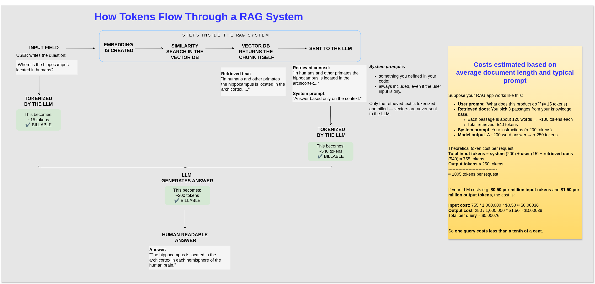

# 🧠 The AI Engineering Challenge: Technical Notes

This document provides a deep dive into the theoretical concepts, architecture, and cost considerations for building the **ContentNavigatorAI** RAG system.

## 🛠️ Theoretical Considerations

### 1. The RAG Acronym Paradox

**Runtime Focus: The R-A-G Flow**
**RAG** (**Retrieval-Augmented Generation)** is a **_method_**, and **LangChain** is a **framework**, which can implement it.

The name "Retrieval-Augmented Generation" (RAG) is pretty much based on the sequence of operations that happen at runtime after the initial knowledge base is built:

**System Build Focus: The A-R-G Flow**

1. **Retrieval** (R) must happen first.
2. The retrieved documents **Augment** (A, or provide context for) the prompt.
3. The LLM then performs the **Generation** (G).

From the system build focus, which follows the execution order, is much like A-R-G.

- **A - Augmentation/Indexing (The Build Phase)**: This is the mandatory preparation step before any user query is processed. Your code correctly labeled this as the Indexing Phase.
- **R - Retrieval (The Search Phase)**: This is the first step that runs during a user query, searching the index created in A.
- **G - Generation (The Answer Phase)**: This is the final step that runs during a user query, using the context retrieved in R to generate the answer.

Taken together, the acronym order (RAG) is runtime-focused, while the system build focus, which follows the execution order, is much like A-R-G.

<br></br>

### 2. Core Components of the RAG System

The listed order of components also follows the steps in the Augmentation (A) / Initialization phase of a RAG system.

  
🖼️ open the image in a separate window:
[The RAG Build Phase: From Raw Text to Vector Index](/assets/ai_engineering_rag-build-phase.drawio.png)

### A. CUSTOM DATA 📝

#### 🔧 **Example Source**: Uploaded PDF / JSON / etc. files; or other data sources.

#### 💡 **Example Custom Data**:

```txt
✅ 1. PROVIDED CUSTOM TEXT

The hippocampus (pl.: hippocampi; via Latin from Greek ἱππόκαμπος, 'seahorse'), also hippocampus proper, is a major component of the brain of humans and many other vertebrates. In the human brain the hippocampus, the dentate gyrus, and the subiculum are components of the hippocampal formation located in the limbic system. The hippocampus plays important roles in the consolidation of information from short-term memory to long-term memory, and in spatial memory that enables navigation. In humans and other primates the hippocampus is located in the archicortex, one of the three regions of allocortex, in each hemisphere with direct neural projections to, and reciprocal indirect projections from the neocortex. The hippocampus, as the medial pallium, is a structure found in all vertebrates.

....
```

[example text source: Wikipedia](https://en.wikipedia.org/wiki/Hippocampus)

### B. TEXT SPLITTER ✂️

#### 🔧 **Example Tool**:

`RecursiveCharacterTextSplitter`

#### ⚙️ **How it Works**:

It creates chunks from the original text based on defined parameters:

```python
        text_splitter = RecursiveCharacterTextSplitter(
            chunk_size=1000,
            chunk_overlap=100,
        )
```

The splitter would do the following:

```yml
Chunk 1: characters 0–1000
Chunk 2: characters 900–1900   (starts 100 chars earlier)
Chunk 3: characters 1800–2400
```

This visuals looks like:

```css
[-----1000----]
           [-----1000----]
                     [----end---]
```

NOTE: Overlap prevents meaning loss at chunk boundaries.

#### 💡 **Example Chunk**:

```txt
[Chunk 1]
The hippocampus (pl.: hippocampi; via Latin from Greek ἱππόκαμπος, 'seahorse'), also hippocampus proper, is a major component of the brain of humans and many other vertebrates. In the human brain the hippocampus, the dentate gyrus, and the subiculum are components of the hippocampal formation located in the limbic system. The hippocampus plays important roles in the consolidation of information from short-term memory to long-term memory, and in spatial memory that enables navigation. In humans and other primates the hippocampus is located in the archicortex, one of the three regions of allocortex, in each hemisphere with direct neural projections to, and reciprocal indirect projections from the neocortex. The hippocampus, as the medial pallium, is a structure found in all vertebrates.
```

#### 🧠 **Know-How**:

Chunk size does not affect the total text embedded, but it affects **retrieval quality** and **token costs** (smaller chunks = lower token input cost per retrieval).

**Why smaller chunks?** Better retrieval accuracy, less irrelevant text given to the model, lower token costs.  
**Typical Sizes**: Small (200–300 tokens), Medium (400–800 tokens), Large (1000+ tokens).

### C. EMBEDDING MODEL 🔬

#### 🔧 **Example Tool**: `sentence-transformers/all-MiniLM-L6-v2`

- **Characteristics**: Outputs a **384-dimensional vector**, with values (floating-point numbers) typically **between -1 and 1**.  
  NOTE: Each embedding model has its own characteristics!

#### ⚙️ **How it Works**:

- **Chunks** are **TOKENIZED** (happens once per document ingestion).  
  **Why tokenize?** An embedding model's job is to turn text into a 'meaning vector.' To do that, it must first convert human-readable text into a numerical form the model understands.
- Those tokens are then **VECTORIZED**.  
  **Semantic Fingerprint**: Chunks that mean similar things end up with similar vectors and are stored in nearby positions in the vector space.

#### 💡 **Example Vector**:

(Visual simulation of the first 30 values for Chunk 1)

```rust
Vector for Chunk 1 (384 dimensions):
[
0.12, -0.03, 0.44, -0.55, 0.09, 0.22, -0.41, 0.11,
0.88, -0.14, 0.02, 0.33, -0.32, 0.01, 0.47, -0.19,
0.50, 0.28, -0.22, 0.71, -0.07, -0.02, 0.31, -0.48,
0.16, 0.12, 0.09, -0.33, 0.44, 0.08,
... 354 more numbers ...
]
```

NOTE: Each chunk has 384 dimensions!

#### 🧠 **Know-How**:

**What are vectors?**  
 A vector is simply:

- a list of numbers
- representing the “meaning” of a piece of text
- living in a high-dimensional space - 384, 768, or 1536 dimensions

Small embeddings:

- Shorter vectors: 256, 384, 512 dimensions
- Faster to compute
- Cheaper
  Use in: classification, short text, small datasets

Large embeddings:

- Long vectors: 1024, 1536, 3072 dimensions
- More detailed representation of meaning
- Better semantic understanding
- More expensive
  Use in: large document sets, nuanced text, technical material

**What are embedding values? (The numbers between -1 and 1)**  
When we say an embedding is a vector like:  
[0.12, -0.55, 0.08, …] (384 numbers)

Each number represents a coordinate in a huge mathematical space.  
Think of:  
A 2D point → has 2 numbers: (x, y)  
A 3D point → has 3 numbers: (x, y, z)  
A 384-dimensional point → has 384 numbers

The model chooses 384 because this is the number of features it uses to represent meaning.

Why are the values between -1 and 1?  
This comes from neural network math:

- **tanh** activation → output is always between -1 and 1
- Sometimes layer_norm → also keeps values small  
  So the model forces all 384 values to fall into this range.

**What is a “semantic fingerprint”?**  
Chunks that mean similar things end up in nearby positions.

Examples:  
Text A:  
The hippocampus is involved in memory consolidation.

Text B:  
Memory formation depends on the hippocampal region.

Their embeddings might look like:  
A = [0.10, -0.05, 0.48, ...]  
B = [0.11, -0.03, 0.47, ...]  
→these are almost identical → meaning is similar.

But an unrelated text:  
The Eiffel Tower is located in Paris.

Might be:  
[ -0.88, 0.22, -0.05, ... ]  
→ completely different.

### D. VECTOR DB 🗄️

#### 🔧 **Example Tool**: `Chroma`

#### ⚙️ **How it Works**:

- **Store**: Chroma stores the `id`, the `embedding` (the 384-dim vector), and `metadata` for each chunk.  
  Chroma stores embeddings in a columnar vector index on disk:

```python
collection/
├── embeddings.bin (384 float32 values per row)
├── ids.bin
├── metadata.json
└── documents.bin
```

- **Retrieval**: Chroma performs a **vector similarity** search (_cosine similarity_) between the query's embedding and every stored vector.

#### 💡 **Example Document Structure (Chroma)**:

```json
{
"id": "chunk_1",
"embedding": [0.12, -0.03, 0.44, -0.55, ...],
"metadata": {
"source": "hippocampus_article",
"chunk": 1
},
"document": "The hippocampus (pl.: hippocampi; via Latin ...)"
}
```

<br></br>

## Architecture - Prototype vs Production 🏗️

This section outlines the cost and complexity difference between the local study project and a scalable, cloud-hosted client solution.

| Feature ⚙️      | Prototype (Study Project)                               | 🚀 Production (Client Scenario)                                         |
| --------------- | ------------------------------------------------------- | ----------------------------------------------------------------------- |
| Data Source     | One-time downloaded `JSON` files (static snapshot).     | Dynamic fetch and update (`Cloud Scheduler` + Incremental Indexing).    |
| FastAPI Service | Stored and run locally.                                 | `Cloud Run` (Scalable, containerized, serverless hosting).              |
| Embedding Model | Local, free (`paraphrase-multilingual-MiniLM-L12-v2`).  | API-based (`text-embedding-3-small`) or self-hosted, dedicated service. |
| Vector DB       | Local, free (`Chroma`).                                 | Cloud-Hosted (`Qdrant`, `Pinecone`, or `hosted Chroma`).                |
| LLM Model       | OpenRouter free version (`google/gemma-3-27b-it:free`). | Commercial API (GPT-4o) or self-hosted, larger model.                   |

<br></br>

## 💰 Operational Costs and Scalability Considerations

When scaling to production, four main cost categories appear. These costs behave differently: some scale with user traffic, others with data size.

### What Costs Exist in a System Like InsightHubAI or ContentNavigatorAI? 📏

| Cost Category            | Behavior                         | Primary Drivers                                                                                          |
| ------------------------ | -------------------------------- | -------------------------------------------------------------------------------------------------------- |
| (A) Model (LLM) Costs    | Scales with User Traffic.        | _Input tokens_ (system prompt, user question, retrieved context) and _output tokens_ (generated answer). |
| (B) Embedding Costs      | Scales with Data Size.           | Total document token count; usually a cheap, one-time cost.                                              |
| (C) Vector DB Costs      | Scales with Data Size & Queries. | Storage size, retrieval operations (QPS), and hosting method.                                            |
| (D) Infrastructure Costs | Scales with System Runtime.      | Serverless hosting (e.g., Cloud Run), persistence (Cloud SQL), and automation (Scheduler/Tasks).         |

---

### How Do You Choose LLM, Embeddings, Vector DB? 📏

#### Choose the LLM based on:

- language support (Hungarian → important!)
- accuracy requirements
- price / token
- speed
- context window size

For Hungarian data, Gemma was a surprisingly good choice.

#### Choose Embeddings based on:

- language support (multilingual embeddings!)
- model dimension (256 vs. 384 vs. 768… affects cost + recall)
- compatibility with your vector store
- inference speed/price

Your switch from all-MiniLM → multilingual-MiniLM was exactly the correct reasoning.

#### Choose Vector DB based on:

- dataset size
- retrieval latency needs
- budget
- need for cloud persistence
- features like metadata filtering

Chroma → great for prototypes  
Pinecone → good for scale  
Qdrant → powerful + open-source  
Weaviate → strong hybrid search

---

### LLM Query Flow and Token Cost (Visualized) 📏



🖼️ open the image in a separate window:
[How Tokens Flow Through a RAG System](/assets/ai_engineering_token-flow.drawio.png)

🪜 **Step A** — User Query

```txt
“Where is the hippocampus located in humans?”
```

1. Embedding Model

The query is embedded using the same model used for custom data preparation:

```ini
query_embedding = [0.05, -0.22, 0.91, ...] (384 dimensions)
```

2. LLM
   Tokenizes the user's question --> BILLABLE (user question)

🪜 **Step B** — Vector similarity search

Chroma does:

```scss
cosine_similarity(query_embedding, chunk1_embedding)
```

Result might be:

```ini
similarity = 0.89 (high)
```

So Chroma returns the chunk itself:

```arduino
Retrieved text:
"In humans and other primates the hippocampus is located in the archicortex, ..."
```

🪜 **Step C** — LLM receives the retrieved chunks (text) and system prompt:

Now, it has a whole picture:

```arduino
User question:
"Where is the hippocampus located in humans?"

Retrieved context:
"In humans and other primates the hippocampus is located in the archicortex..."

System prompt:
"Answer based only on the context."
```

🪜 **Step D** — LLM generates the final answer

The LLM does not look at vectors.
It only uses the text retrieved using the vectors.

Example answer:

```txt
The hippocampus is located in the archicortex in each hemisphere of the human brain.
```

---

### Estimating Costs (Theoretical) 📏

#### 🤔 MLL

🪜 **Step 1** - Estimate retrieved context size  
Suppose the retriever returns 3 chunks, each roughly 120 words.  
That corresponds to approximately 180 tokens per chunk.

- Retrieved context: 3 × 180 ≈ 540 tokens

🪜 **Step 2** - Measure system prompt size  
The system prompt defined in the code can be measured using an online token calculator.

- System prompt: ≈ 200 tokens

🪜 **Step 3** - Estimate user input  
Try 3–5 hypothetical user questions (short, medium, conversational).

- User prompt: ≈ 15–40 tokens

🪜 **Step 4** - Estimate output length

- Model answer: ≈ 250 tokens

Theoretical token cost per request:

```rust
Total input tokens ≈ system (200) + user (15) + retrieved docs (540)
≈ 755 tokens
Output tokens ≈ 250 tokens
---
≈ 1005 tokens per request
```

If the LLM costs $0.50 per million input tokens and $1.50 per million output tokens:

```rust
Input cost: 755 / 1,000,000 _ $0.50 ≈ $0.00038
Output cost: 250 / 1,000,000 _ $1.50 ≈ $0.00038
Total per query ≈ $0.00076
```

**_Total per query ≈ $0.00076_**  
So one query costs **less than a tenth of a cent**.

With 50 requests per day:

- Daily cost ≈ $0.038
- Monthly cost ≈ $1.10

This estimation is intentionally approximate. Real systems vary depending on retriever behavior, prompt evolution, and user interaction patterns.

What this estimation does not capture (by design):

- retrievers returning more chunks
- long conversational history
- tool or function calls
- retries and error handling

These belong to production monitoring and post-launch optimization, not early-stage architectural reasoning.

#### 🤔 EMBEDDING MODEL

Even though embeddings are "one-time," it is still useful to estimate their impact.

🪜 **Step 1** - Estimate total text size  
Example:
500 blog posts
Average length ≈ 1,200 tokens

```ini
Total ≈ 600,000 tokens
```

Exact tokenization is not required. Rough heuristics are sufficient:

- English ≈ 4 characters per token
- Hungarian ≈ 3–4 characters per token

These are practical approximations, not strict rules.

🪜 **Step 2** - Estimate embedding throughput  
For a typical MiniLM model:

- CPU: ~500–2,000 tokens/sec
- GPU: ~5,000–20,000 tokens/sec

```ini
600,000 tokens ÷ 2,000 tokens/sec ≈ 5 minutes
```

🪜 **Step 3** - Estimate storage cost  
See the following paragraph.

#### 🤔 VECTOR DB

The larger the dimension of the embedding (e.g., sentence-transformers/all-MiniLM-L6-v2 uses a 384-dimensional vector, other embedding models, e.g., 768), the larger the vector, the more space is taken in the DB.

Example:

- 100,000 chunks
- embedding dimension 384
- float32 numbers → 4 bytes per number

Storage ≈

```ini
100,000 _ 384 _ 4 bytes = 153,600,000 bytes
≈ 153 MB
```

If you use 1536 dimensions (4× bigger):

```ini
≈ 600 MB
```

If your DB is huge (millions of chunks), dimension matters a LOT for cost + performance.

#### 🤔 CLOUD INFRASTRUCTURE

In a cloud setup, infrastructure costs may include:

- Cloud Run (serverless hosting)
- Cloud Storage
- Cloud Scheduler / Cloud Tasks
- networking and API calls

Serverless platforms significantly reduce costs by scaling to zero when idle.

---

### Putting Numbers on it: ContentNavigatorAI 💰

⚙️ PROTOTYPE

- LLM: free-tier model
- Embedding model: sentence-transformers/paraphrase-multilingual-MiniLM-L12-v2
- Vector DB: local Chroma
- Hosting: local machine

Operational cost: effectively zero; only the developers' efforts would incur costs.

🚀 PRODUCTION  
Architecture assumptions:

- LLM: GPT-4o
- Embedding model: text-embedding-3-small (API) or self-hosted MiniLM
- Vector DB: Qdrant (self-hosted on GCP) or Pinecone (managed)
- Hosting: Cloud Run (GCP)
- Traffic: ~50 queries/day

Estimated monthly costs (low traffic):

- LLM usage: ~$1–2
- Vector DB + storage: ~$5–10
- Infrastructure: a few dollars

Total: comfortably under $15/month + the developer's costs.
At higher traffic, LLM usage becomes the dominant cost - but it scales linearly and predictably.

Overview:

| Scenario      | Operational Cost                       | Developer Cost                                                                          |
| ------------- | -------------------------------------- | --------------------------------------------------------------------------------------- |
| ⚙️ Prototype  | Effectively zero (local, free models). | 100% of the project's expense, covering design, engineering, and data preparation time. |
| 🚀 Production | Under $15/month (low traffic).         | Cost of building a robust, scalable, and optimized architecture.                        |

<br></br>
